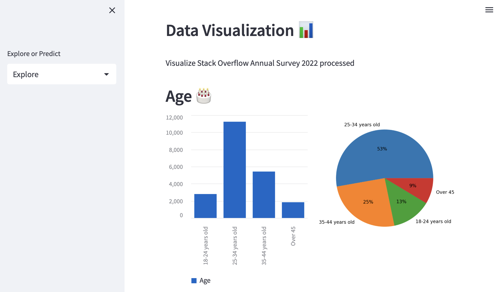
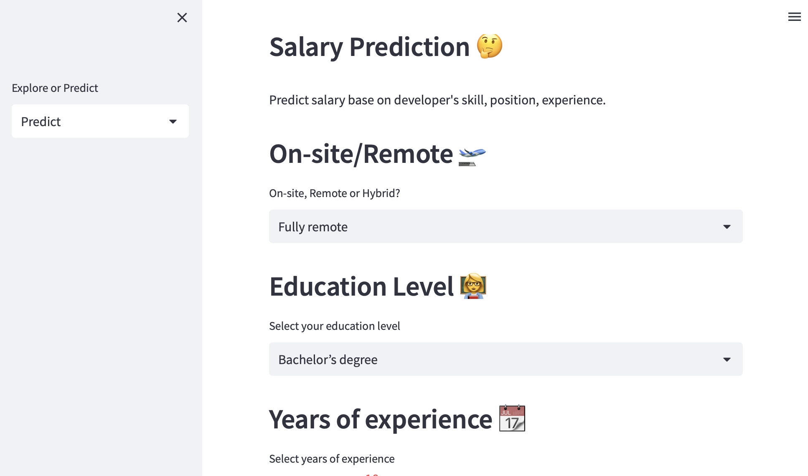

# Developer's Salary Prediction

## Dataset

* Use **Stack Overflow Annual Developer Survey** to train model. Download the dataset at [here](https://insights.stackoverflow.com/survey)

* For Salary prediction purpose, use 9 features `RemoteWork`, `EdLevel`, `YearsCodePro`, `DevType`, `LanguageHaveWorkedWith`, `PlatformHaveWorkedWith`, 
`ToolsTechHaveWorkedWith`,
`Country`, `Age` to predict `ConvertedCompYearly` as Salary.

* Data preprocessing: [preprocess.py](dataset/preprocess.py)

* Data visualization: [visual.ipynb](visual.ipynb)

## Model

* Ultilize [Ensemble Method](https://scikit-learn.org/stable/modules/ensemble.html) to train model.

* Experiment with [Decision Tree](https://scikit-learn.org/stable/modules/generated/sklearn.tree.DecisionTreeRegressor.html), [RandomForest](https://scikit-learn.org/stable/modules/generated/sklearn.ensemble.RandomForestRegressor.html), [Bagging](https://scikit-learn.org/stable/modules/generated/sklearn.ensemble.BaggingRegressor.html), [AdaBoost](https://scikit-learn.org/stable/modules/generated/sklearn.ensemble.AdaBoostRegressor.html), [GradientBoosting](https://scikit-learn.org/stable/modules/generated/sklearn.ensemble.GradientBoostingRegressor.html). 

* Detail training and testing process in [main.ipynb](main.ipynb)

* Apply [GridSearchCV](https://scikit-learn.org/stable/modules/generated/sklearn.model_selection.GridSearchCV.html) found best hyperparameter for `Gradient Boosting`.

### Best Result

| Metrics | Values |
| --- | --- | 
| [RMSE](https://scikit-learn.org/stable/modules/generated/sklearn.metrics.mean_squared_error.html) | 37068.786 |  
| [MAE](https://scikit-learn.org/stable/modules/generated/sklearn.metrics.mean_absolute_error.html) | 25121.021 |   
| [R2-score](https://scikit-learn.org/stable/modules/generated/sklearn.metrics.r2_score.html) | 0.619 | 

## Run Code

1. Install dependencies

```
pip install -r requirements.txt
```

2. Download dataset & extract zip file

```
wget <link-to-data>
unzip stack-overflow-developer-survey-2022.zip -d data
```

3. Run streamlit web app

I build a streamlit app to easily view the data and predict the salary.

Run code:

```
streamlit run web.py
```
## Web demo


